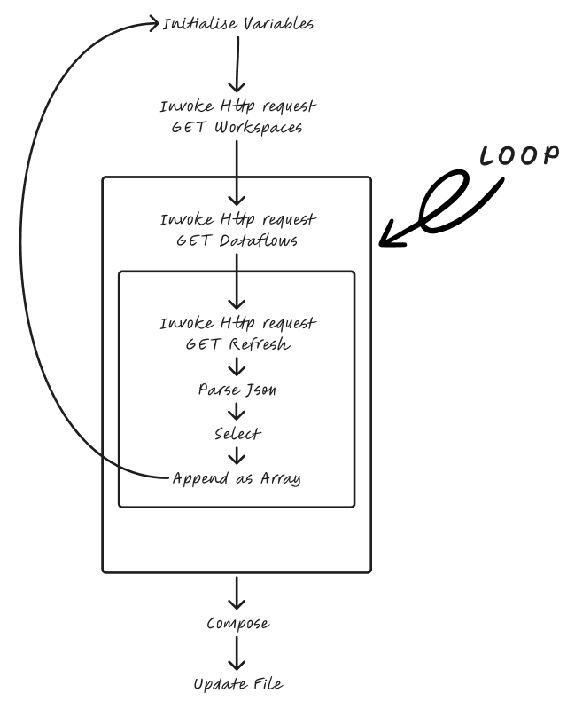

# Power BI Service Metadata Monitoring

## Contents

-  ### [Project Summary](#project-summary)

-  ### [The Problem](#problem)

-  ### [Project Summary](#solution-overview)

-  ### [Power Automate](#power-automate)
    -  #### [API Catalogue](#api-catalogue)
    -  #### [Loops](#loops)

---

### Project Summary

This project provides a centralised monitoring solution for Power BI Service assets using Power Automate and Power BI.

Power BI environments can quickly become difficult to manage as the number of workspaces, reports, semantic models, dataflows and source files grows. While metadata exists across multiple areas of the Power BI Service, there is often no single location where owners can assess platform health, refresh status, lineage and source dependencies.

This solution automates the collection of Power BI Service metadata using Power Automate and stores the results in a structured format for reporting and governance purposes. The resulting Power BI dashboard provides visibility of assets across the platform and highlights potential issues before they impact business users.

Key capabilities include:

- Workspace, report, dataset and dataflow inventory.
- Refresh history and monitoring.
- SharePoint source file discovery from Dataflow M Code.
- Identification of stale or potentially outdated source files.
- Automated metadata collection with minimal manual maintenance.
- Improved visibility of data lineage between source files, dataflows and reports.
- Reduced reliance on manual documentation processes.

The project was developed in an environment without Power BI Admin access or access to Microsoft Purview, requiring metadata and lineage information to be assembled through available APIs and automation techniques.

---

## Problem

There was no single view for monitoring workspace, report, dataflow and refresh metadata across the Power BI Service.

Key challenges included:

- Limited visibility of platform-wide assets.
- Difficulty identifying failed or delayed refreshes.
- No consolidated inventory of dataflows and their source files.
- Manual documentation becoming outdated over time.
- Limited governance tooling available to non-administrator users.

---

## Solution Overview

Power Automate collects metadata from the Power BI Service and stores it in a structured format. Power BI then connects to that data and provides a monitoring dashboard.

Where possible, Dataflow M Code is analysed to identify SharePoint source files and reconstruct source locations. This enables monitoring of source file modification dates alongside Dataflow refresh information, helping identify situations where reports may be refreshing successfully but source data is no longer being updated.

---

## Architecture

Add your architecture notes or diagram here.

Suggested flow:

SharePoint Source Files

↓

Power BI Dataflows

↓

Semantic Models / Datasets

↓

Reports

↓

Power Automate Metadata Collection

↓

Monitoring Dataset

↓

Power BI Monitoring Dashboard

---

## Power Automate

The basic concept of the Power automate flow is to extrapolate live service data using the Invoke action and dumping onto SharePoint as txt files for use in dataflows in the next stage. The concept is simple, however the use of loops and invoke actions exponentially increases the capacity and leads to errors and long runtimes, which required workarounds. 

### API Catalogue
The first step was exploring the Microsoft catalogue of APIs to understand what is and is not accessible and to make not of the codes. These are what I will be using in the invoke actions within the flow. https://learn.microsoft.com/en-us/rest/api/power-bi/dataflows/get-dataflow-transactions#dataflowtransaction

Invokes are APIs that can extrapolate data across service, outputting the data as JSON. Below is the list of data I was able to access to build the report. 

- Apps
- Reports
- Workspaces
  - Users
  - Dataflows
    - Refreshes
    - Dataflow Mcode
    - Parent Dataflows
    - Entities
  - Semantic Models
    - Refreshes
    - Refresh Schedules
    - Dataflows used in model
    - Users

#### Caveats 

- Available APIs
  - APIs are not always consistent between the objects, such as refresh schedules that can only be pulled for models and not the dataflows. 

- Dataflow Connections
  - Dataflow parents are only brought out by the API if the Entity that is used to bring in the parent dataflow is loaded in. Otherwise Service cannot see the connection. This is also true for the 'View item lineage' option within Service, so this is a limitation shared between the two.
        
- Dataflow Sources
  - Any source files used by dataflows such as SharePoint files cannot be picked up exactly by an API. There is an ability to flag if it using a SharePoint file but not much other data is provided so useless to extract. The way around this is to extract the dataflows MCode and find the data within that code. It is less elegant and prone to caveats but I will touch on this more later on. 

### Loops

As the Invoke actions sometimes require the IDs of other items I have invoked, such as an invoke dataflow which requires a workspace ID, I looped through each workspace ID that was extracted from the previous invoke workspace action. On top of this, I append that data into an array 

---

## Power BI Dashboard

Explain the dashboard pages and key visuals.

Suggested pages:

### Overview
- Workspaces
- Reports
- Dataflows
- Datasets
- Recent Refresh Status

### Refresh Monitoring
- Failed Refreshes
- Long Running Refreshes
- Refresh Trends

### Dataflow Inventory
- Dataflow Metadata
- Source Type
- Source Locations

### Source File Monitoring
- Source Files
- Last Modified Dates
- Stale File Alerts
- Dataflow Dependencies

### Lineage & Governance
- Dataflow → Source Relationships
- Report → Dataflow Relationships
- Risk and Impact Analysis

---

## Screenshots

Add screenshots here.

---

### Dataflow M Code Extraction Function

- Supports SharePoint.Files and SharePoint.Contents connectors.
- Explicit #"Folder Path" references are treated as the highest-confidence matches.
- SharePoint.Contents navigation chains are reconstructed using sequential navigation steps.
- Queries using Text.Contains([Folder Path], ...) may not expose the full folder structure.
- Dynamically generated paths and parameter-driven URLs cannot always be reconstructed.
- The function prioritises accuracy over inference and does not attempt to guess missing folder levels.
- URLs reconstructed from inferred folder filters should be treated as guidance rather than definitive lineage.

---

## Lessons Learned

Suggested topics:

- Working without Power BI Admin permissions.
- Metadata availability limitations within Power BI APIs.
- Challenges associated with reconstructing lineage from M Code.
- Benefits of automating governance activities.
- Importance of confidence-based source identification.

---

## Future Improvements

Potential enhancements:

- Confidence scoring for all discovered source files.
- Support for additional connector types.
- Automated stale file alerting.
- Historical metadata tracking.
- Dataflow dependency visualisation.
- Integration with Microsoft Purview if available.
- Automated ownership and support contact tracking.
- Refresh SLA monitoring.
